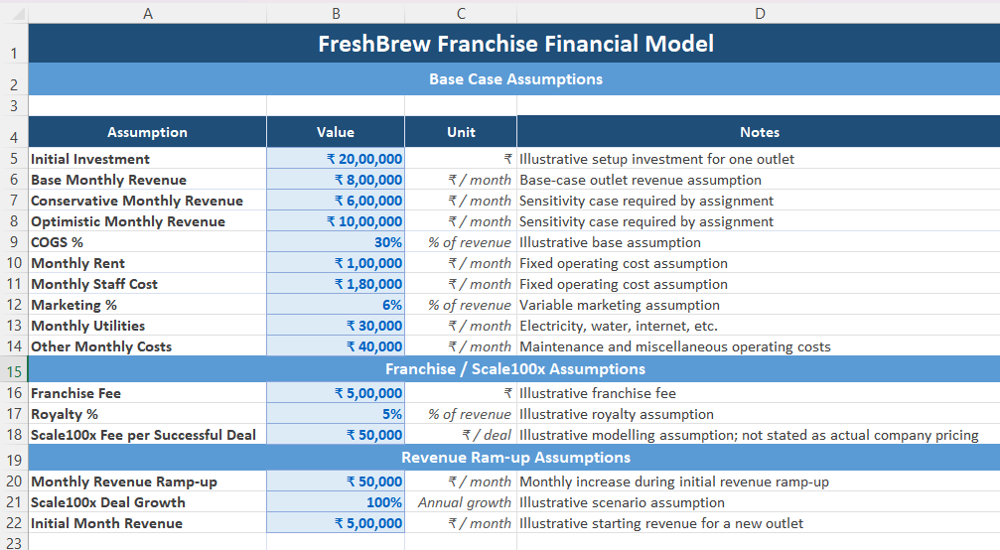
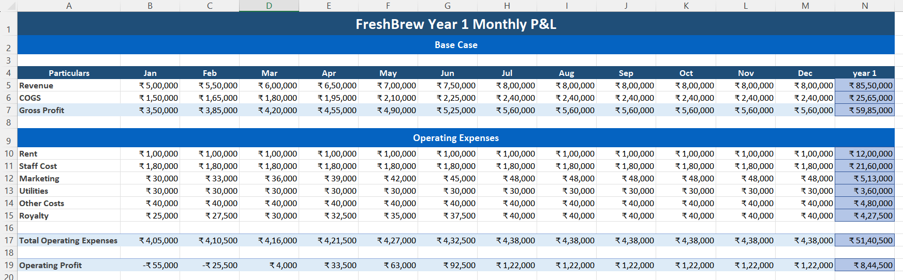
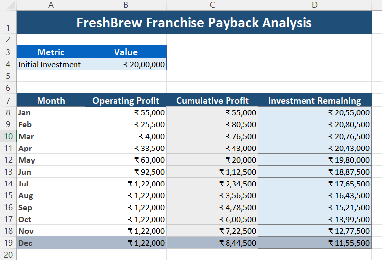
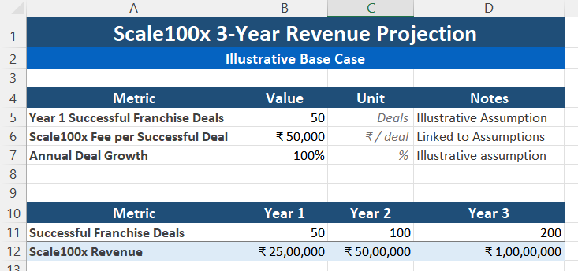
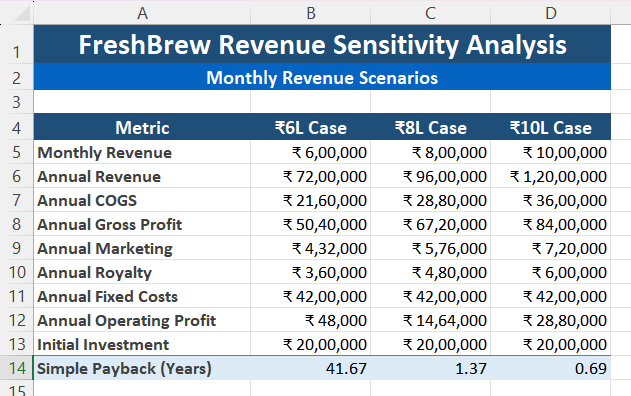
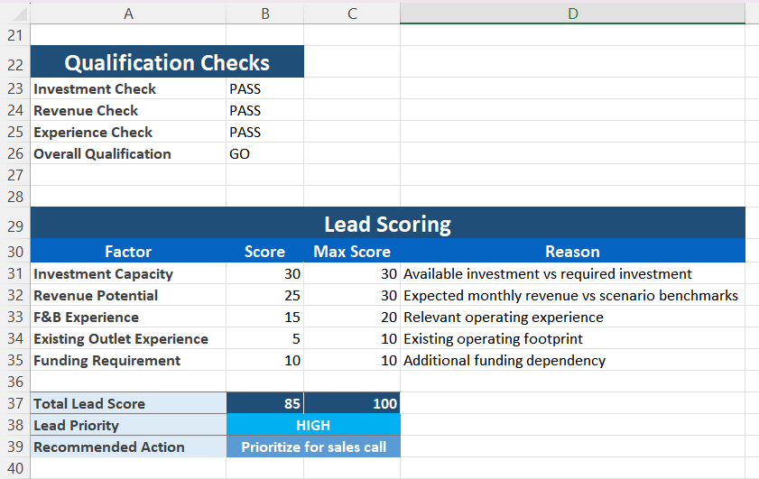

# FreshBrew Franchise Financial Model

## Overview

This folder contains the financial model developed for evaluating the financial feasibility and growth potential of a FreshBrew franchise opportunity.

The model uses an illustrative base case and evaluates the franchise through operating projections, payback analysis, revenue scenarios, sensitivity analysis, lead scoring, and Scale100x revenue projections.

## Model Components

### 1. Base Case Assumptions

The assumptions sheet establishes the key inputs used throughout the financial model, including:

- Initial investment
- Base monthly revenue
- Conservative monthly revenue
- Optimistic monthly revenue
- COGS percentage
- Monthly rent
- Monthly staff cost
- Marketing percentage
- Monthly utilities
- Other monthly costs
- Franchise fee
- Royalty percentage
- Scale100x fee per successful deal
- Monthly revenue ramp-up
- Scale100x deal growth
- Initial month revenue

The assumptions are structured so that the model can be updated by changing the input values.

### 2. Year 1 Monthly P&L

The monthly P&L projects the first-year operating performance of the franchise.

It includes:

- Monthly revenue
- COGS
- Gross profit
- Rent
- Staff cost
- Marketing
- Utilities
- Other costs
- Royalty
- Total operating expenses
- Operating profit

The model includes monthly projections from January to December along with a Year 1 total.

### 3. Franchise Payback Analysis

The payback analysis tracks the recovery of the initial investment through cumulative operating profit.

It includes:

- Initial investment
- Monthly operating profit
- Cumulative profit
- Investment remaining

This helps assess how quickly the initial franchise investment is recovered under the base-case operating assumptions.

### 4. Scale100x 3-Year Revenue Projection

The Scale100x projection models illustrative revenue generated from successful franchise deals over a three-year period.

The model considers:

- Year 1 successful franchise deals
- Scale100x fee per successful deal
- Annual deal growth
- Successful franchise deals by year
- Scale100x revenue for Years 1–3

The Scale100x assumptions are illustrative modelling assumptions and should not be interpreted as actual company pricing unless independently verified.

### 5. Revenue Sensitivity Analysis

The sensitivity analysis evaluates the franchise under three monthly revenue scenarios:

- ₹6,00,000 case
- ₹8,00,000 case
- ₹10,00,000 case

For each scenario, the model calculates:

- Annual revenue
- Annual COGS
- Annual gross profit
- Annual marketing
- Annual royalty
- Annual fixed costs
- Annual operating profit
- Initial investment
- Simple payback period

This allows the financial outcome to be compared across conservative, base, and optimistic revenue assumptions.

### 6. Lead Scoring

The model also includes a franchise lead scoring framework based on:

- Investment capacity
- Revenue potential
- F&B experience
- Existing outlet experience
- Funding requirement

The model calculates a total lead score and uses it to determine lead priority and the recommended sales action.

### 7. AI-Enabled Lead Automation

The model includes an illustrative workflow for automating franchise lead qualification.

The workflow covers:

1. Lead generation through Meta Ads
2. WhatsApp conversation
3. AI-led qualification
4. Lead information extraction
5. CRM record creation
6. Lead scoring and prioritisation
7. Consultant follow-up and conversion

The workflow also identifies human checkpoints, estimated time savings, and key risks.

## Key Outputs

The financial model is designed to help evaluate:

- Franchise operating profitability
- Initial investment recovery
- Revenue sensitivity
- Franchise growth potential
- Scale100x revenue potential
- Franchise lead quality
- Potential operational efficiency from AI-enabled lead qualification

## Screenshots

### Base Case Assumptions

### Year 1 Monthly P&L

### Franchise Payback Analysis

### Scale100x 3-Year Revenue Projection

### Revenue Sensitivity Analysis

### Lead Scoring

## Important Note

The financial model contains illustrative assumptions for modelling and analysis. In particular, the franchise fee, royalty, Scale100x fee, deal growth, revenue assumptions, and other commercial inputs should be independently validated before being used for an actual investment or business decision.
