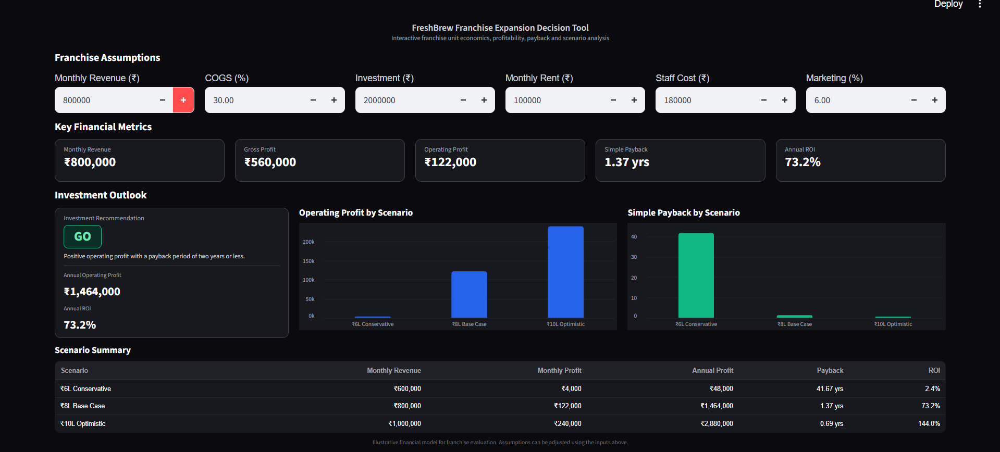

# FreshBrew ROI Dashboard

## Overview

This folder contains the interactive ROI dashboard developed for evaluating FreshBrew franchise economics and investment scenarios.

The dashboard provides an interactive way to explore key financial assumptions, revenue scenarios, profitability, unit economics, and investment decisions.

## Live Dashboard

The dashboard is deployed using Streamlit.

Live application:

https://freshbrew-roi-dashboard.streamlit.app/

## Dashboard Features

The dashboard provides an interactive view of the major financial and investment considerations for a FreshBrew franchise.

### Dashboard Inputs

Users can modify key financial assumptions and evaluate how changes affect the resulting financial outcomes.

The dashboard is designed to make the underlying financial model easier to explore and interpret.

### Revenue Scenarios

The dashboard compares different monthly revenue scenarios and shows their effect on annual revenue and profitability.

The scenarios include:

- ₹6 lakh monthly revenue
- ₹8 lakh monthly revenue
- ₹10 lakh monthly revenue

### Profit Scenario Analysis

The dashboard presents operating profit under different revenue assumptions, allowing users to compare conservative, base, and optimistic outcomes.

### Unit Economics

The dashboard provides a view of the key economics of operating a franchise outlet, including revenue, costs, profitability, and investment considerations.

### Investment Decision

The dashboard translates the financial analysis into an investment-oriented view to help assess whether the opportunity meets the defined financial criteria.

## AI Development Notes

The `AI-Development-Notes.md` file documents the AI-enabled development and lead qualification workflow considered as part of the project.

The workflow covers:

- Lead capture
- WhatsApp-based qualification
- AI-assisted information extraction
- CRM lead creation
- Lead scoring
- Lead prioritisation
- Human consultant handoff

The workflow also considers time savings and operational risks associated with AI-assisted lead qualification.

## Screenshots

### Dashboard 




## Files

| File | Description |
|---|---|
| `app.py` | Streamlit application |
| `requirements.txt` | Python dependencies required to run the dashboard |
| `AI-Development-Notes.md` | Documentation of the AI-enabled lead qualification workflow |
| `screenshots/` | Dashboard screenshots used for documentation |

## Running Locally

Clone the repository and navigate to the dashboard folder.

Install the required dependencies:

```bash
pip install -r requirements.txt

Run the Streamlit application:
streamlit run app.py

The application will open in a local browser.

## Important Note

The dashboard uses illustrative financial assumptions for analysis. The outputs are intended for modelling and decision-support purposes and should not be treated as verified commercial or investment advice.
